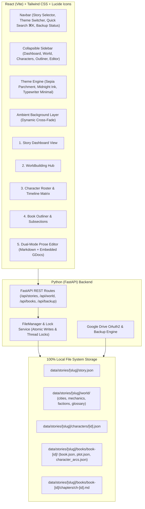

# Walkthrough: Local-First Fiction Writer Suite

We have fully constructed and launched the local-first fiction writing application designed for fiction writers to manage worldbuilding, plot outlines, character arcs, and raw Markdown prose with Google Drive backup integration.

---

## 🛠️ Architecture Summary



---

## Key Modules Implemented

### 1. Data Architecture & Atomic File Storage ([`file_manager.py`](file:///Users/sarthaksri/Desktop/writer_job/backend/app/file_manager.py), [`file_utils.py`](file:///Users/sarthaksri/Desktop/writer_job/backend/app/file_utils.py))
- Thread-safe and crash-safe atomic file writing (`os.replace` via temp files with `fsync` and canonical `threading.Lock`).
- Manages directory structures under `/data/stories/[story-slug]/`.

### 2. FastAPI REST Routes ([`main.py`](file:///Users/sarthaksri/Desktop/writer_job/backend/app/main.py))
- Full CRUD for stories, character profiles, dynamic world sections (`cities`, `mechanics`, `factions`, `glossary`), multi-book structures, plot beats, character arcs, and raw Markdown chapter prose.
- **Appearances Matrix Endpoint** (`/api/stories/{story_id}/characters/{char_id}/appearances`): Real-time filesystem scanner returning linked books, chapters (with POV flags), and plot beats.
- **Google OAuth2 & Backup Endpoints** (`/api/auth/google`, `/api/backup/google-drive`, `/api/backup/status`).

### 3. Frontend Theme Engine & Ambient Atmosphere ([`ThemeContext.jsx`](file:///Users/sarthaksri/Desktop/writer_job/frontend/src/context/ThemeContext.jsx), [`AmbientBackground.jsx`](file:///Users/sarthaksri/Desktop/writer_job/frontend/src/components/AmbientBackground.jsx))
- **3 Literary Themes**: *Sepia Parchment* (light paper), *Midnight Ink* (dark slate navy), and *Typewriter Minimal* (monochrome contrast).
- **Google Fonts**: `Lora` / `EB Garamond` for serif prose and character cards, `Inter` for UI controls.
- **Ambient Layer**: Smooth cross-fade transition overlay when `story.background_url` updates.

### 4. Interactive Modules
- **Home** ([`HomeView.jsx`](file:///Users/sarthaksri/Desktop/writer_job/frontend/src/components/modules/HomeView.jsx)): All-stories gallery with dynamic background image picker, quick-add tags, and New Story creation.
- **Story Dashboard** ([`DashboardView.jsx`](file:///Users/sarthaksri/Desktop/writer_job/frontend/src/components/modules/DashboardView.jsx)): Dedicated per-story view with a Story Overview (add/remove paragraphs), a random Summary · Fun Fact card, and the aesthetic theme picker.
- **Character Roster & Appearances Matrix** ([`CharacterRosterView.jsx`](file:///Users/sarthaksri/Desktop/writer_job/frontend/src/components/modules/CharacterRosterView.jsx)): Avatar cards, local image upload or URL link, interactive vertical timeline component, and auto-scanned appearances matrix badges.
- **Worldbuilding Hub & Concept Art Gallery** ([`WorldbuildingView.jsx`](file:///Users/sarthaksri/Desktop/writer_job/frontend/src/components/modules/WorldbuildingView.jsx)): Tabbed interface for Cities, Magic & Mechanics, Factions, Lexicon, and **Gallery & Concept Art** with lore context and local asset uploads.
- **Book Outliner** ([`BookOutlinerView.jsx`](file:///Users/sarthaksri/Desktop/writer_job/frontend/src/components/modules/BookOutlinerView.jsx)): Tree view of Books → Chapters → Scenes, Plot Beats sheet, Character Arcs per book, and POV Tracker.
- **Dual-Mode Writing Editor** ([`DraftEditorView.jsx`](file:///Users/sarthaksri/Desktop/writer_job/frontend/src/components/modules/DraftEditorView.jsx)): Local Markdown Editor with live preview & 1000ms debounced autosave + Embedded Google Docs iframe edit window.
- **One-Click Backup Engine** ([`GoogleDriveModal.jsx`](file:///Users/sarthaksri/Desktop/writer_job/frontend/src/components/GoogleDriveModal.jsx)): Live sync status badge (`"In Sync"`, `"Syncing..."`, `"Error"`) and progress notification toast.

---

## 🚀 Running the Platform

1. **FastAPI Backend**:
   ```bash
   PYTHONPATH=backend .venv/bin/uvicorn app.main:app --host 127.0.0.1 --port 8000
   ```
2. **Vite Frontend**:
   ```bash
   cd frontend && npm run dev
   ```
   Open [http://localhost:3000/](http://localhost:3000/) in your browser.
